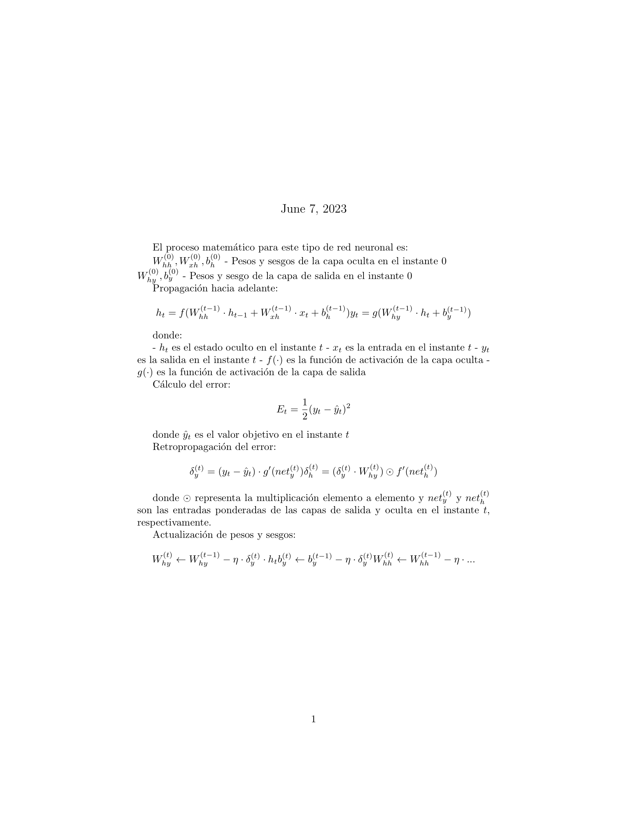

# Redes Neuronales: Un modelo computacional inspirado en el funcionamiento del cerebro humano

Autor: Julian Villaseñor Ibarra  
Maestría en Ciencia de Datos

Una red neuronal es un modelo computacional inspirado en el funcionamiento del cerebro humano. Está compuesta por un conjunto interconectado de unidades básicas llamadas neuronas artificiales o nodos, que trabajan en conjunto para resolver problemas de manera paralela y aprender a partir de los datos.

Cada neurona artificial en una red neuronal está conectada a otras neuronas mediante enlaces o conexiones ponderadas. Estos enlaces representan la fuerza de la conexión entre las neuronas y se utilizan para transmitir señales entre ellas. Cada neurona recibe una o varias entradas, las procesa mediante una función de activación y produce una salida que puede ser enviada como entrada a otras neuronas.

Las redes neuronales pueden tener diferentes arquitecturas, pero una de las más comunes es la red neuronal feedforward o red neuronal de alimentación directa. En este tipo de red, las señales fluyen en una sola dirección, desde las capas de entrada, pasando por una o varias capas ocultas, hasta llegar a la capa de salida.

El funcionamiento de una red neuronal se basa en principios matemáticos fundamentales. Para comprender cómo las redes neuronales toman decisiones y procesan la información, es importante conocer los conceptos matemáticos.
## Algunos ejemplos de aplicaciones de redes neuronales:

- Reconocimiento de imágenes: Las redes neuronales se utilizan para reconocer objetos, caras o patrones en imágenes. Por ejemplo, se pueden entrenar redes neuronales para reconocer gatos en fotografías.
- Procesamiento del lenguaje natural: Las redes neuronales se utilizan en tareas como traducción automática, análisis de sentimientos, generación de texto, entre otros. Por ejemplo, los chatbots y los asistentes virtuales utilizan redes neuronales para entender y responder a las preguntas en lenguaje natural.
- Pronóstico y predicción: Las redes neuronales se pueden utilizar para predecir valores futuros en series de tiempo, como el precio de las acciones, la demanda de productos, el clima, entre otros.
- Reconocimiento de voz: Las redes neuronales se emplean en sistemas de reconocimiento de voz para convertir el habla en texto o para identificar comandos de voz en dispositivos inteligentes.
- Conducción autónoma: Las redes neuronales se utilizan en vehículos autónomos para reconocer objetos en tiempo real, tomar decisiones de conducción y controlar los sistemas de navegación.

## Esquema general que involucra las redes neuronales:

1. Recopilación y preparación de datos: En esta etapa, se recopilan los datos relevantes para el problema que se desea resolver. Los datos pueden provenir de diferentes fuentes, como bases de datos, archivos, sensores, etc. Además, es necesario preparar los datos para que estén en un formato adecuado para su procesamiento por una red neuronal. Esto puede incluir la limpieza de datos, la normalización, la codificación de variables categóricas, etc.
2. Diseño de la arquitectura de la red: En esta etapa, se define la estructura de la red neuronal, incluyendo el número de capas, la cantidad de neuronas en cada capa, la función de activación, etc. Esto depende en gran medida del tipo de problema que se está abordando y los datos disponibles.
3. Entrenamiento de la red: En esta etapa, se utiliza un algoritmo de aprendizaje para ajustar los parámetros de la red neuronal. Se presenta a la red los datos de entrenamiento junto con las salidas esperadas, y la red ajusta sus conexiones ponderadas para minimizar la diferencia entre las salidas predichas y las salidas esperadas. Este proceso se repite iterativamente hasta que la red alcanza un nivel satisfactorio de precisión en la tarea.
4. Validación y ajuste: Después del entrenamiento, se utiliza un conjunto de datos separado, llamado conjunto de validación, para evaluar el rendimiento de la red neuronal. Esto permite ajustar los hiperparámetros de la red, como la tasa de aprendizaje o el número de capas ocultas, con el fin de mejorar el rendimiento.
5. Evaluación y predicción: Una vez que la red neuronal ha sido entrenada y ajustada, se puede utilizar para hacer predicciones o clasificaciones en nuevos datos. La red recibe las entradas y genera salidas basadas en los patrones aprendidos durante el entrenamiento.

Problema de interés: Predicción de Bitcoin

Para predecir los precios de la criptomoneda Bitcoin basados en un conjunto de datos, usaré el modelo de Redes Neuronales Recurrentes, las cuales están específicamente diseñadas para el análisis de tiempo. Las redes neuronales recurrentes son adecuadas para modelar dependencias secuenciales y son ampliamente utilizadas en este tipo de problemas de predicción de series de tiempo.

Dentro de las Redes Neuronales Recurrentes, se encuentran las redes neuronales LSTM, que en inglés significa Long Short-Term Memory (Memoria a Corto y Largo Plazo). Estas son muy efectivas en el modelado de secuencias a largo plazo y evitan el problema del desvanecimiento del gradiente. La arquitectura básica de una red neuronal LSTM incluye celdas de memoria que permiten recordar información a largo plazo y puertas de entrada, salida y olvido que controlan el flujo de información en la red.

Ejemplo de código de una red neuronal LSTM:

from keras.models import Sequential
from keras.layers import LSTM, Dense

model = Sequential()
model.add(LSTM(units=64, input_shape=(timesteps, features)))
model.add(Dense(units=1))

model.compile(optimizer='adam', loss='mean_squared_error')
model.fit(X_train, y_train, epochs=10, batch_size=32)

El proceso matemático para este tipo de red neuronal es:

